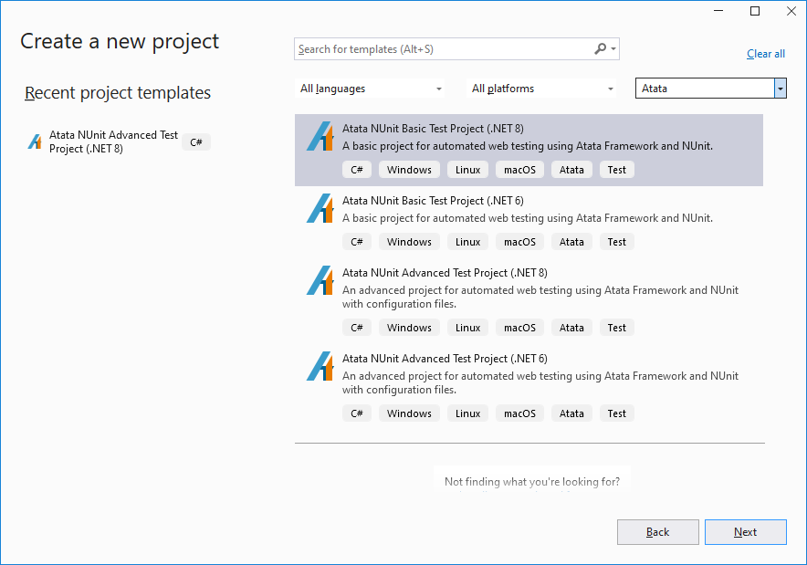
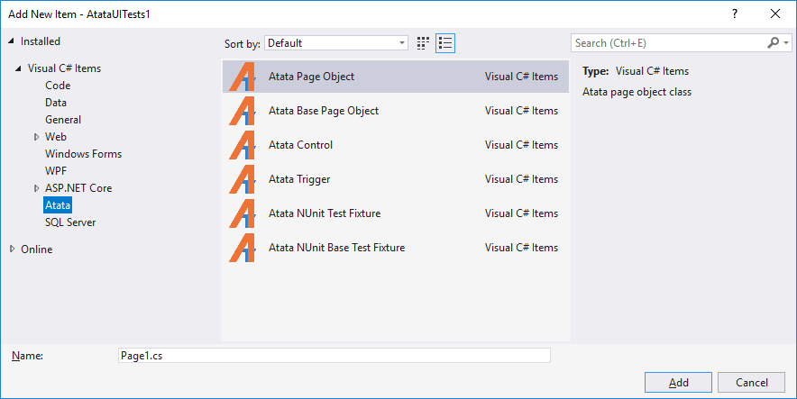

# Atata Templates

[Atata Templates](https://marketplace.visualstudio.com/items?itemName=YevgeniyShunevych.AtataTemplates) Visual Studio extension - a set of project and class templates for web automated testing using [Atata Framework](https://atata-framework.github.io/).

The extension contains:

- Project templates:
  - Atata NUnit Test Project (.NET Framework)
  - Atata NUnit Test Project (.NET Core)
  - Atata Components Library (.NET Framework)
  - Atata Components Library (.NET Standard)
- Item templates:
  - Atata Page Object
  - Atata Base Page Object
  - Atata Control
  - Atata Trigger
  - Atata NUnit Test Fixture
  - Atata NUnit Base Test Fixture

All templates are located on Visual Studio's **New Project** and **New Item** windows inside **Atata** category.

*Find out more on [Atata](https://atata-framework.github.io/) and check out [Atata repository](https://github.com/atata-framework/atata).*